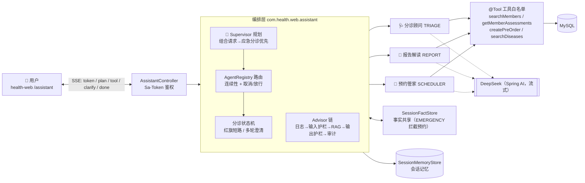

# 基于 LLM 的多 Agent 分诊就医系统

<p align="left">
  
  
  
  
  
  
  
</p>

> 对外产品名：**智能医疗系统** · 仓库：**triagent**（Triage + Agent）
>
> 一句话：**让 AI 先判断「该不该去医院、去哪个科」，再领航完成「报告解读 → 门诊预约」的多智能体就医助手。**

在成熟的健康管理平台（会员 / 预约 / 评估 / 干预 / 知识库）之上，叠加了一套以 **Spring AI 1.0.0 GA + DeepSeek** 驱动的
**多 Agent 编排层**：流式输出、透明工具调用、RAG 知识溯源、双护栏、Supervisor 规划、医疗安全状态机与运行期指标。

---

## ✨ 为什么值得看

| # | 能力 | 说明 |
|---|------|------|
| 1 | **Supervisor 规划** | 组合请求（「胸痛…帮我约…」）被规划为**应急分诊优先**：TRIAGE 状态机确定性输出 EMERGENCY，0 LLM 调用、不落单；既往/复诊语境经过去式判定不误伤 |
| 2 | **多 Agent 事实协作** | `SessionFactStore` 共享结构化会话事实：分诊出 EMERGENCY 后，预约管家落单前被确定性拦截，澄清「已排除」后放行 |
| 3 | **医疗安全状态机** | 部位→时长→伴随 多轮澄清为确定性状态机；红旗（胸痛/卒中/呼吸困难…）强制 EMERGENCY 短路，附急救指引，不依赖 LLM |
| 4 | **透明推理** | 工具调用经 SSE 侧通道下发 `tool_call` / `tool_result` / `plan` 事件，前端逐步展示「Agent 为什么这么走」 |
| 5 | **RAG 溯源 + 防注入** | 疾病库/科普文章检索注入并标记「外部不可信」；来源随 `done` 回传，可点击溯源 |
| 6 | **预约两步确认 + 幂等** | Agent 只落 PENDING 预订单（sha256 幂等键 + Redis 预占 + DB 唯一索引兜底），页面确认后转 CONFIRMED |
| 7 | **可观测** | 每轮耗时 / turnType / 工具次数 / 紧急度分布 / 护栏命中，`/metrics` 聚合近 500 轮 |
| 8 | **结构化输出** | `BeanOutputConverter(TriageResult)` + 提示词内嵌 JSON Schema + 解析失败自动重试，输出稳定 |

**量化评估（30 例 golden set + LLM-as-Judge 双轨裁判，真实 DeepSeek）**：紧急度 **0.88** · 科室命中 **28/29** · 规则综合 **9.24 / 10** · LLM 裁判安全性 **29/29 pass** · 危险方向误判（判轻）**0 例** · 确定性路径 **6–24ms（0 LLM 调用）** vs LLM 路径均值 5.3s。逐例数据与裁判意见见 [测试数据报告](docs/agent/测试数据报告.md) / [评估报告-LLM裁判](docs/agent/评估报告-LLM裁判.md) / [评估报告](docs/agent/评估报告.md)。

---

## 🏗 架构一览



---

## 📡 SSE 事件协议

| event | 载荷 | 说明 |
|---|---|---|
| `token` | `string` | 模型逐字输出 |
| `plan` | `{decision, reason}` | Supervisor 编排决策：`TRIAGE_FIRST`（组合请求应急分诊优先）/ `SAFETY_BLOCK`（EMERGENCY 事实拦截预约） |
| `tool_call` / `tool_result` | `{name, arguments}` / `{name, result}` | 透明工具调用 |
| `clarify` | `{question, missing[]}` | 状态机追问（bodyPart / duration / accompany） |
| `done` | `{answer, triage, agent, sources[]}` | 回答 + 结构化分诊 + 命中 Agent + 知识来源 |
| `error` | `{message}` | 失败兜底 |

## 🔌 主要端点

| 方法 | 路径 | 说明 | 鉴权 |
|---|---|---|---|
| POST | `/api/v1/assistant/chat` | Agent 流式对话（SSE） | Sa-Token |
| POST | `/api/v1/assistant/preorders/{id}/confirm` | 确认预订单（两步确认第二步） | Sa-Token |
| GET | `/api/v1/assistant/metrics` | Agent 运行指标（近 500 轮聚合） | Sa-Token |

---

## 🚀 快速开始

**环境**：JDK 17+ · Maven 3.9+ · Node 18+ · MySQL · Redis · DeepSeek API Key

```bash
git clone https://github.com/UniqueDevJing/triagent.git
```

### 后端（8080）

```bash
cp .env.example .env                  # 填 DB_PASSWORD / LLM_API_KEY
mysql -u root -p < sql/init.sql       # 首次建库建表
mvn -pl health-admin -am install -DskipTests
mvn -pl health-admin spring-boot:run
# Windows/GitBash 先注入环境变量： set -a; . ./.env; set +a
# 注意：Spring AI base-url 读 LLM_BASE_URL_ROOT（根地址，不带 /v1）
```

API 文档：<http://localhost:8080/doc.html>

### 前端（3000）

```bash
cd health-web && npm install && npm run dev
# 登录 admin/admin123 → 左侧「智能分诊」→ http://localhost:3000/assistant
```

### 环境变量

| 变量 | 说明 |
|---|---|
| `DB_HOST` / `DB_PORT` / `DB_PASSWORD` | MySQL |
| `LLM_API_KEY` / `LLM_MODEL` | DeepSeek 密钥与模型（deepseek-chat） |
| `LLM_BASE_URL_ROOT` | Spring AI OpenAI base-url，**不带 /v1** |
| `SPRING_PROFILES_ACTIVE` | dev / prod |

---

## 🧭 端到端演示脚本（可直接照着试）

1. `我胸痛还呼吸困难，持续半小时了` → **EMERGENCY** 红旗短路（确定性，附 120 指引与来源）
2. `我最近不太舒服` → 多轮澄清追问 → 补齐后输出结构化分诊
3. `解读会员孙明伟的体检报告` → `searchMembers → getMemberAssessments` 工具链 + 个性化解读
4. `帮孙明伟预约呼吸内科` → 预约管家反问日期/主诉 → 生成 PENDING 预订单 → 页面确认转 CONFIRMED（同参数重复请求幂等返回同一单）
5. `胸痛…帮我预约呼吸内科`（组合请求）→ **Supervisor** 决策「应急分诊优先」，前端出现 🧭 编排决策步骤

---

## 📁 项目结构

```
├── health-common/         公共：AjaxResult、BaseEntity、注解、异常
├── health-system/         业务实体 + Mapper（含 AgentPreOrder）
├── health-framework/      Sa-Token 配置、全局异常、SSE 工具
├── health-admin/          ★ 主启动模块（8080），Agent 编排层
│   └── com.health.web.assistant/
│       ├── controller/    SSE chat / 预订单确认 / metrics
│       ├── agent/         AssistantOrchestrator · AgentRegistry · SymptomStateMachine
│       ├── advisor/       Logging(0) → InputGuardrail(10) → Rag(20) → OutputGuardrail(80) → Audit(100)
│       ├── tool/          AgentToolkit(@Tool) · ToolEventPublisher
│       ├── rag/           KnowledgeRetriever（MySQL 混合检索，预留向量接口）
│       ├── memory/        SessionMemoryStore · AgentSessionState · SessionFactStore
│       ├── service/       PreOrderService（幂等） · AgentMetricsService
│       └── config/        AssistantConfig（ChatClient + 提示词 + JSON Schema）
├── health-web/            Vue 3 前端（views/assistant/AssistantChat.vue 透明推理页）
├── sql/init.sql           权威建表脚本（含 agent_preorder）
├── docs/agent/            框架设计 · 实施计划 · 评估方案 · 评估报告 · 功能验证报告
└── pom.xml                Spring AI BOM 1.0.0
```

## 🗺 演进里程碑

- **Phase 1** 编排骨架 + SSE 流式 + 双护栏/审计 ✅
- **Phase 2** 多 Agent 路由 + 工具事件可视化 + 预约幂等 ✅
- **Phase 3** RAG 溯源 + 分诊状态机 ✅
- **Phase 4** 可观测指标 + 前端透明推理页 + G1–G10 评估 ✅
- **Phase 5** 会话连续性路由 + 多 Agent 事实协作 + Supervisor 规划 + `plan` 事件可视化 ✅
- **Roadmap** 向量检索（pgvector/Milvus）· Supervisor 全语义规划（LLM 拆子任务）· 单元测试补齐 · Docker Compose 一键起

## 🛡 医疗安全与工程约定

- **不做诊断**：产品语义严格限定「分诊建议 / 报告解读 / 预约辅助」，输出强制免责声明。
- **安全优先**：红旗 EMERGENCY 与事实拦截均为确定性代码路径，不依赖模型服从性。
- **密钥只在 `.env`**（不入库）；Controller 不含业务逻辑；SQL 只改 `sql/init.sql`。
- **测试与文档**：`docs/agent/`（框架设计 / 实施计划 / 评估方案 / 评估报告 / 功能验证报告）。
